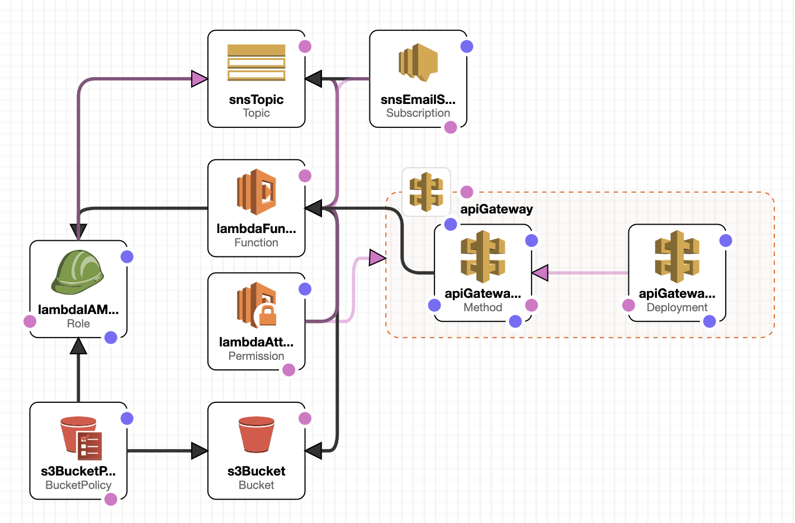
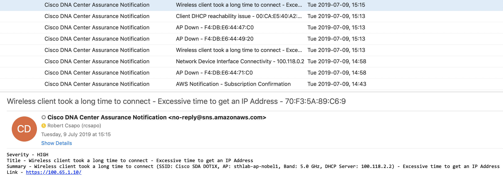
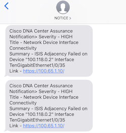
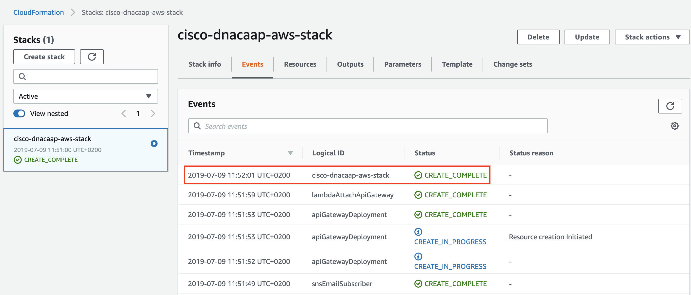
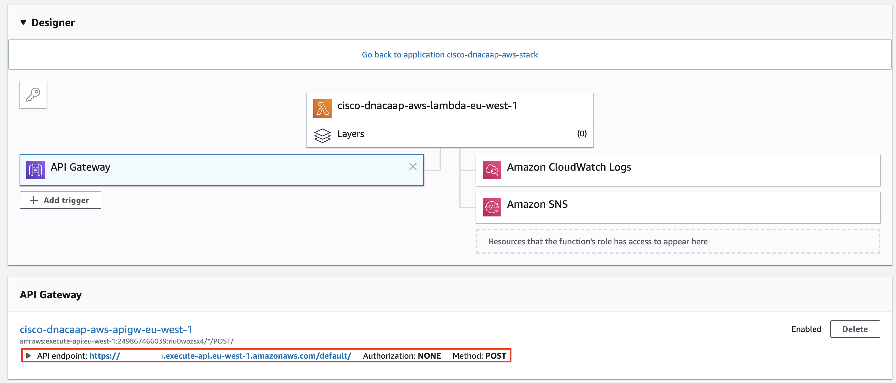

# Cisco DNA Center Assurance Notifications to AWS SNS (email/sms)  
[](https://developer.cisco.com/codeexchange/github/repo/robertcsapo/cisco-dnacaap-assurance-aws-sns)

Forward events from Cisco DNA Center Platform API to Amazon Simple Notification Service (SNS).  
The Subscribers on AWS SNS can be Email, SMS, HTTPS or other AWS Services.  
https://aws.amazon.com/sns/faqs/

In this solution we'll focus on Email and SMS (optional) subscription of AWS SNS.

## Screenshot

### Quick Deployment Demo

### AWS Cloudformation Template

### Emails
_(Cisco DNA Center Issues sent as Email)_  

### SMS
_(Cisco DNA Center Issues sent as SMS)_  


## Requirements
  - AWS Account (Free Tier https://aws.amazon.com/free/)
    - IAM Privileges to create Lambda, API Gateway, SNS, S3 and IAM Role
  - Cisco DNA Center 1.2.10+
    - Platform Bundle Enabled
  - Network Connectivity from Cisco DNA Center to Internet (AWS)
    - https/443
  - Subscriber Account
    - Email
    - Mobile Number (optional)

## TLDR (too long; didn't read) - Deployment

### AWS CloudFormation  
Supported Regions: **us-east-1,	us-west-2, ap-northeast-1, ap-southeast-1, ap-southeast-2, eu-north-1, eu-central-1, eu-west-1**  
(If more is needed, please raise an issue)
AWS SNS SMS Support: https://docs.aws.amazon.com/sns/latest/dg/sms_supported-countries.html

This will be created in your AWS Region
- AWS Lambda
  - Process JSON Payload from Cisco DNA Center and send it to S3/SNS
- API Gateway
  - Receive JSON Payload from Cisco DNA Center and send it to Lambda
- S3 Bucket
  - Storing JSON Payload from Cisco DNA-C for Archive purpose
- SNS
  - Delivering the Notifications from Cisco DNA-C (AWS Lambda) to Subscribers

### Deploying with Cloudformation Template (AWS CLI)

- Download github repo or **cisco-dnacaap-aws-cf.yaml**
- Run AWS CLI on your terminal
  - ```aws cloudformation deploy --template-file ./cisco-dnacaap-aws-cf.yaml --capabilities CAPABILITY_IAM --stack-name cisco-dnacaap-aws-notifications --parameter-overrides EmailSubscriber=your@email.tld --region us-west-2```
- Now Navigate to your **AWS Lambda**
- Your function is called **cisco-dnacaap-aws-lambda-$AWS-REGION**
- Click on your **API Gateway**
  - **API endpoint** - Here is your **AWS Lambda API Gateway URL** (see section in Cisco DNA Center Config)

### Deploying with Cloudformation Template (GUI)

- Download github repo or **cisco-dnacaap-aws-cf.yaml**
- Navigate to Cloudformation on your AWS Console
- Click **Create Stack**
  - Choose **Upload a Template file**
  - Drag and drop **cisco-dnacaap-aws-cf.yaml**
- Click **Next**
  - Choose **Stack Name** (eg. cisco-dnacaap-aws-notifications)
  - Choose your email account (needs to be valid) TODO
- Click **Next** (nothing required to fill out on this page)
- Accept IAM Checkbox (in the bottom)
  - **"I acknowledge that AWS CloudFormation might create IAM resources."**
- Click **Create stack**

Wait until the Stack is created (if something is stuck, cancel and try again).  
You'll receive an Email to confirm your AWS SNS Membership on Email and Accept.  
If you want to add more members then go to AWS SNS and choose **cisco-dnacaap-aws-sns-$AWS-REGION**



### Navigate to your AWS Lambda Function
- Click on your Function called **cisco-dnacaap-aws-lambda-$AWS-REGION**
- Click on your **API Gateway**
  - **API endpoint** - Here is your **AWS Lambda API Gateway URL** (see section in Cisco DNA Center Config)



### Configuring Cisco DNA Center (GUI)
If you can't see the "Platform" tab on the top, then go to **Systems Settings** -> **Software Updates** -> **Installed Apps** to install "DNAC Platform"

* Enable Cisco DNA Center as a Platform
	- How-To Guide https://www.cisco.com/c/en/us/td/docs/cloud-systems-management/network-automation-and-management/dna-center-platform/1-3-1-0/user_guide/b_dnac_platform_ug_1_3_1_0/b_dnac_platform_ug_1_3_1_0_chapter_010.html
* Configure Cisco DNA Center Events (https://<dnac-ip>/dna/systemSettings/settings?settings-item=dnacp-events-settings)
	- How-To Guide https://www.cisco.com/c/en/us/td/docs/cloud-systems-management/network-automation-and-management/dna-center-platform/1-3-1-0/user_guide/b_dnac_platform_ug_1_3_1_0/b_dnac_platform_ug_1_3_1_0_chapter_010.html
	- Adam Radford's Blog https://blogs.cisco.com/developer/event-notifications-in-webex-teams

## Technologies & Frameworks Used
* Python3
* AWS
  - Lambda (Python)
  - SNS
  - S3
* Cisco DNA Center Platform API

## Authors & Maintainers

- Robert Csapo <rcsapo@cisco.com>

## License

This project is licensed to you under the terms of the [Cisco Sample
Code License](./LICENSE).
