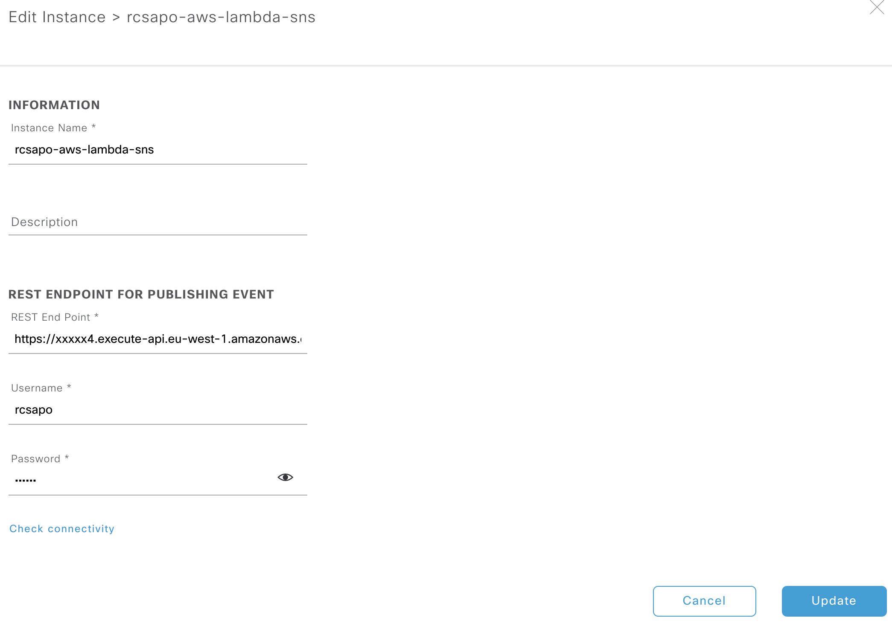

# Cisco DNA Center Assurance Notifications to AWS SNS (email/sms)
Forward events from Cisco DNA Center Platform API to Amazon Simple Notification Service (SNS)
The Subscribers on AWS SNS can be Email, SMS, HTTPS or other AWS Services.

In this solution we'll focus on Email and SMS (optional) subscription of AWS SNS.
## Screenshot
### AWS Cloudformation Template

### Emails

### SMS

## Requirements
  - AWS Account (Free Tier https://aws.amazon.com/free/)
    - IAM Privileges to create Lambda, API Gateway, SNS, S3 and IAM Role
  - Cisco DNA Center 1.2.10+
    - Platform Bundle Enabled
  - Network Connectivity from Cisco DNA Center to Internet (AWS)
    - https/443
  - Subscriber Account
    - Email
    - Mobile Number (optional)

## TLDR (too long; didn't read) - Deployment

AWS CloudFormation  
Supported Regions: **us-east-1,	us-west-2, ap-northeast-1, ap-southeast-1, ap-southeast-2, eu-north-1, eu-central-1, eu-west-1**  
(If more is needed, please raise an issue)
AWS SNS SMS Support: https://docs.aws.amazon.com/sns/latest/dg/sms_supported-countries.html

This will be created in your AWS Region
- AWS Lambda
  - Process JSON Payload from Cisco DNA Center and send it to S3/SNS
- API Gateway
  - Receive JSON Payload from Cisco DNA Center and send it to Lambda
- S3 Bucket
  - Storing JSON Payload from Cisco DNA-C for Archive purpose
- SNS
  - Delivering the Notifications from Cisco DNA-C to Subscribers

### Deploying with Cloudformation Template

- Download github repo or **cisco-dnacaap-aws-cf.yaml**
- Navigate to Cloudformation on your AWS Console
- Click **Create Stack**
  - Choose **Upload a Template file**
  - Drag and drop **cisco-dnacaap-aws-cf.yaml**
- Click **Next**
  - Choose **Stack Name** (eg. cisco-dnacaap-aws-notifications)
  - Choose your email account (needs to be valid) TODO
- Click **Next** (nothing required to fill out on this page)
- Accept IAM Checkbox (in the bottom)
  - **"I acknowledge that AWS CloudFormation might create IAM resources."**
- Click **Create stack**

Wait until the Stack is created (if something is stuck, cancel and try again).  
You'll receive an Email to confirm your AWS SNS Membership on Email and Accept.  
If you want to add more members then go to AWS SNS and choose **cisco-dnacaap-aws-sns-$AWS-REGION**

### Navigate to your AWS Lambda Function
- Click on your Function called **cisco-dnacaap-aws-lambda-$AWS-REGION**
- Click on your **API Gateway**
  - **API endpoint** - Here is your **AWS Lambda API Gateway URL** (see section in Cisco DNA Center Config)

### Configuring Cisco DNA Center
If you can't see the "Platform" tab on the top, then go to **Systems Settings** -> **Software Updates** -> **Installed Apps** to install "DNAC Platform"

- Click on **Bundles**
- Enable **Network Events for REST API Endpoint**
- Configure **Network Events for REST API Endpoint**
  - Choose **Create a new instance**
    - Set **Instance Name** (this can be changed if needed)
    - **Description** could be that it's pointing to your AWS Lambda
    - **REST End Point** points to your **AWS Lambda API Gateway URL** (see section in AWS deployment)
    - **Username/Password** - choose anything (we don't validate this in AWS)
- **"Success"** should be displayed and click on **"View Now"**
  - This takes you to **Developer Toolkit** -> **Integration Flows**
- Click on **Schedule to publish Network Events - REST Endpoint connector**
  - Choose any **Repeats/Run At Interval**
  - Click on **Resume** or **Schedule**
- Click on **Manage** -> **Configurations** (in the top)
  - **Event Settings**
    - Verify that all items that you prefer is marked and click **Save** (bottom corner)

## Technologies & Frameworks Used
* Python3
* AWS
  - Lambda
  - SNS
  - S3
* Cisco DNA Center Platform API

## Authors & Maintainers

- Robert Csapo <rcsapo@cisco.com>

## License

This project is licensed to you under the terms of the [Cisco Sample
Code License](./LICENSE).
